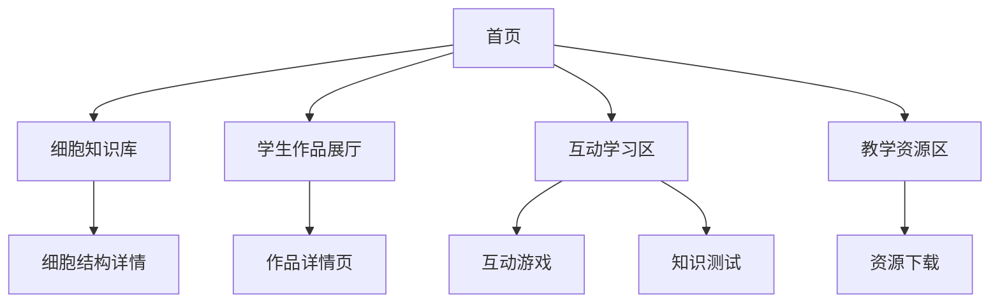

## 1. 产品概述
“细胞里的靖边”是一个专注于高中生物细胞结构教育的线上数字博物馆，旨在通过互动式展示和多媒体内容帮助学生深入理解细胞生物学知识。该平台将整合权威教材知识点、学生作品展示、互动学习工具等功能，为师生提供沉浸式的细胞结构学习体验。

## 2. 核心功能

### 2.1 用户角色
| 角色 | 注册方式 | 核心权限 |
|------|----------|----------|
| 访客用户 | 无需注册 | 浏览基础知识、查看展品、使用学习工具 |
| 学生用户 | 学校账号登录 | 提交作品、参与互动、保存学习进度 |
| 教师用户 | 教师账号登录 | 管理学生作品、发布教学资源、查看学习数据 |

### 2.2 功能模块
线上博物馆包含以下核心页面：
1. **首页**：博物馆导览、展品导航、最新活动展示
2. **细胞知识库**：细胞结构详解、功能说明、3D模型展示
3. **学生作品展厅**：学生绘图作品、3D模型、学习心得展示
4. **互动学习区**：细胞拼图游戏、结构识别测试、虚拟实验
5. **教学资源区**：教案下载、教学视频、实验指导
6. **关于我们**：项目介绍、使用帮助、联系方式

### 2.3 页面详情
| 页面名称 | 模块名称 | 功能描述 |
|----------|----------|----------|
| 首页 | 导航栏 | 提供主要功能入口，包含搜索功能 |
| 首页 | 轮播展区 | 展示精选展品和学生优秀作品 |
| 首页 | 快速入口 | 直达知识库、作品展厅、互动学习 |
| 细胞知识库 | 结构导航 | 按细胞膜、细胞质、细胞核分类展示 |
| 细胞知识库 | 3D模型查看器 | 支持360度旋转、缩放、标注显示 |
| 细胞知识库 | 知识点详解 | 基于人教版教材的权威内容展示 |
| 学生作品展厅 | 作品分类 | 按绘画、模型、心得分类浏览 |
| 学生作品展厅 | 作品详情 | 展示作品图片、作者信息、创作说明 |
| 学生作品展厅 | 上传功能 | 支持图片、模型文件上传 |
| 互动学习区 | 细胞拼图 | 拖拽组件完成细胞结构组装 |
| 互动学习区 | 知识测试 | 选择题和拖拽题形式的互动测试 |
| 互动学习区 | 虚拟实验 | 模拟显微镜观察细胞过程 |
| 教学资源区 | 资源下载 | 提供教案、PPT、实验指导下载 |
| 教学资源区 | 视频播放 | 嵌入教学视频播放器 |

## 3. 核心流程
### 访客用户流程
访客访问首页 → 浏览细胞知识库 → 查看学生作品 → 使用互动学习工具 → 下载教学资源

### 学生用户流程
学生登录 → 浏览学习内容 → 完成互动练习 → 上传个人作品 → 查看学习进度

### 教师用户流程
教师登录 → 管理学生作品 → 发布教学资源 → 查看班级学习数据 → 下载教学材料

## 4. 用户界面设计

### 4.1 设计风格
- **主色调**：科技蓝 (#2563eb) 搭配细胞绿 (#10b981)
- **辅助色**：浅灰 (#f3f4f6) 和白色背景
- **按钮样式**：圆角矩形，悬停动画效果
- **字体选择**：中文使用思源黑体，英文使用Inter字体
- **图标风格**：Font Awesome线性图标，统一尺寸规范
- **布局风格**：卡片式布局，响应式网格系统

### 4.2 页面设计概览
| 页面名称 | 模块名称 | UI元素 |
|----------|----------|--------|
| 首页 | 导航栏 | 固定顶部，包含logo、主导航、搜索框，高度64px |
| 首页 | 轮播展区 | 全宽轮播，自动切换，支持手势滑动，高度400px |
| 首页 | 内容卡片 | 圆角卡片设计，阴影效果，悬停上浮动画 |
| 知识库 | 侧边导航 | 固定左侧，树状结构，当前项高亮显示 |
| 知识库 | 3D模型区 | 占据右侧主要区域，黑色背景突出模型 |
| 作品展厅 | 画廊布局 | 瀑布流或网格布局，支持筛选和排序 |
| 互动学习 | 游戏界面 | 居中布局，大按钮设计，清晰的操作提示 |

### 4.3 响应式设计
- **桌面端**：优先设计，充分利用屏幕空间，多栏布局
- **平板端**：768px断点，调整为双栏或单栏布局
- **移动端**：适配小屏幕，采用汉堡菜单，简化交互
- **触控优化**：按钮最小44px，支持手势操作