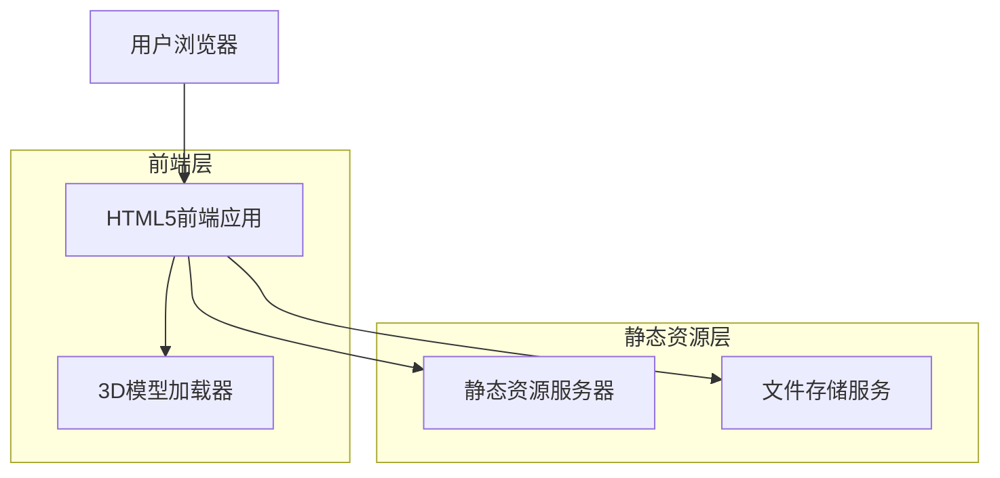
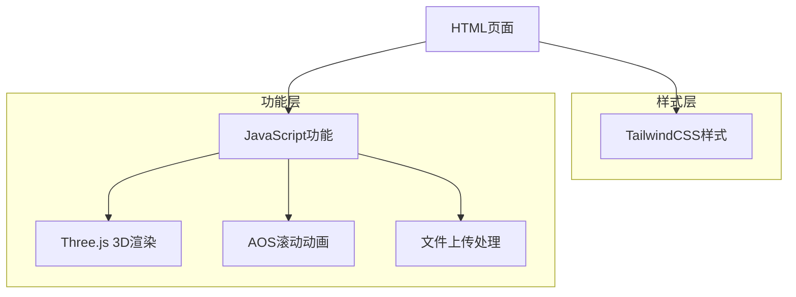

## 1. 架构设计



## 2. 技术描述

* **前端**: HTML5 + TailwindCSS 3.0 + Font Awesome

* **初始化工具**: 无（纯HTML项目）

* **3D渲染**: Three.js（用于细胞模型展示）

* **动画库**: AOS (Animate On Scroll) 滚动动画

* **文件存储**: 本地文件系统（按目录结构组织）

* **构建工具**: 无（纯静态网站，可直接运行）

## 3. 路由定义

| 路由                            | 目的        |
| ----------------------------- | --------- |
| /index.html                   | 首页，博物馆主入口 |
| /knowledge/index.html         | 细胞知识库主页面  |
| /knowledge/membrane.html      | 细胞膜结构详情   |
| /knowledge/cytoplasm.html     | 细胞质结构详情   |
| /knowledge/nucleus.html       | 细胞核结构详情   |
| /gallery/index.html           | 学生作品展厅    |
| /gallery/upload.html          | 作品上传页面    |
| /interactive/index.html       | 互动学习区主页面  |
| /interactive/game-puzzle.html | 细胞拼图游戏    |
| /interactive/game-quiz.html   | 知识测试游戏    |
| /resources/index.html         | 教学资源下载区   |
| /about/index.html             | 关于我们页面    |

## 4. 文件目录结构

### 4.1 内容分类目录

```
/basic-knowledge/
├── cell-membrane/
│   ├── index.html
│   ├── structure.md
│   └── images/
├── cytoplasm/
│   ├── index.html
│   ├── organelles.md
│   └── images/
└── nucleus/
    ├── index.html
    ├── structure.md
    └── images/

/student-works/
├── guide-plans/
│   ├── template1.docx
│   └── template2.docx
├── drawings/
│   ├── student1/
│   │   ├── work1.jpg
│   │   └── info.json
│   └── student2/
│       ├── work2.jpg
│       └── info.json
└── models/
    ├── 3d-model1.glb
    └── 3d-model2.glb

/assets/
├── css/
│   ├── main.css
│   └── tailwind.css
├── js/
│   ├── main.js
│   ├── three.min.js
│   └── aos.js
├── images/
│   ├── logo.png
│   └── backgrounds/
└── fonts/
    └── inter/
```

### 4.2 核心文件说明

* **index.html**: 首页文件，包含导航和轮播组件

* **knowledge/**: 细胞知识相关页面集合

* **gallery/**: 学生作品展示相关页面

* **interactive/**: 互动学习游戏页面

* **assets/**: 静态资源文件夹，包含CSS、JS、图片等

* **basic-knowledge/**: 权威教材知识点内容

* **student-works/**: 学生作品分类存储

## 5. 前端架构设计



## 6. 数据模型（本地JSON）

### 6.1 学生作品数据结构

```json
{
  "studentWork": {
    "id": "unique-id",
    "studentName": "学生姓名",
    "class": "班级信息",
    "workType": "drawing|model|essay",
    "title": "作品标题",
    "description": "作品说明",
    "filePath": "文件路径",
    "uploadDate": "上传日期",
    "teacherReview": {
      "score": 85,
      "comment": "评语内容",
      "reviewDate": "评审日期"
    }
  }
}
```

### 6.2 细胞知识点数据结构

```json
{
  "knowledgePoint": {
    "id": "unique-id",
    "category": "membrane|cytoplasm|nucleus",
    "title": "知识点标题",
    "content": "详细内容",
    "images": ["图片路径数组"],
    "model3D": "3D模型路径",
    "difficulty": "easy|medium|hard",
    "relatedPoints": ["相关知识点ID数组"]
  }
}
```

## 7. 关键技术实现

### 7.1 响应式设计

* 使用TailwindCSS的响应式前缀（sm:, md:, lg:, xl:）

* 主要断点：640px, 768px, 1024px, 1280px

* 移动端优先的弹性布局设计

### 7.2 3D模型展示

* 使用Three.js加载GLB/GLTF格式的3D模型

* 实现鼠标控制旋转、缩放功能

* 添加热点标注和结构说明

### 7.3 文件上传功能

* 纯前端实现，使用HTML5 File API

* 支持图片格式：JPG, PNG, GIF

* 支持3D模型格式：GLB, GLTF

* 文件大小限制：图片10MB，模型50MB

### 7.4 动画效果

* 页面滚动时使用AOS库添加渐入动画

* 按钮悬停使用CSS transition效果

* 轮播图支持自动播放和手势滑动

